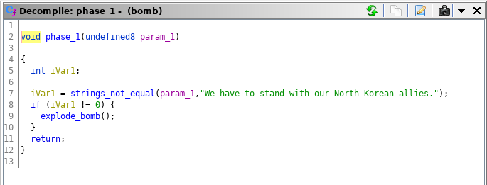

I did most of the first half of this lab using static analysis with IDA and Ghidra and a little bit of dynamic analysis with gdb, and the rest using gdb

## Phase 1
This phase was definetely the easiest of the phases, sort of a "hello world" of reverse engineering
For this phase we can either use gdb or ghidra to very simply get this answer.
If we use ghidra, we can use the decompile window with the phase1 function to see the string it gets compared to

Alternatively, if we use gdb instead, we can simply disassemble the phase_1 function, and see that it is comparing two strings

The string it is comparing our input to is stored at the memory address 0x402440 in this case so we can look at this with x/25c 0x402440 and this give us part of the string
To get the whole string we need to up it to x/48c and we can find the string we need

Either way we can see that our string is "We need to stand with our North Korean allies."

Entering this string shows us we have passed the first phase
